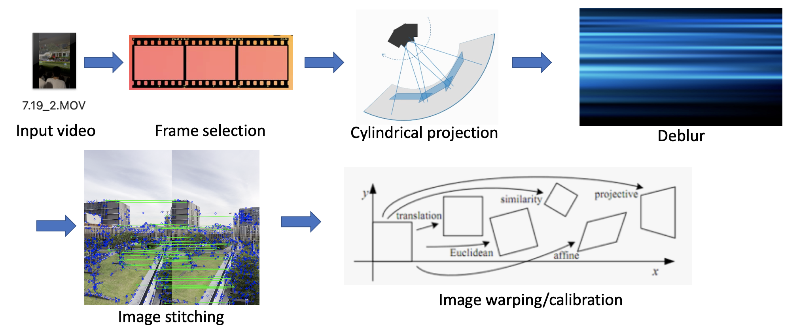

# EIE4512 Obtaining High-quality Panorama from Videos
This project is the final project of EIE4512 (Digital Image Processing) in the Chinese University of Hongkong, Shenzhen.

## Introduction
Panorama construction is an essential research topic in digital image processing. Researchers have done a lot on panorama construction methods, most of which focus on image stitching, but few consider video stitching. This project studies panorama construction from videos. In terms of frame selection, we proposed a binary search method based on the similarity between neighboring frames. We further achieved cylindrical projection to eliminate distortion of the panorama. Finally, The obtained panorama is deblurred by analyzing the camera’s motion.

Key points of the implementation are explained in details in the [report](https://github.com/thiefCat/EIE4512_pano_proj/blob/main/report/Group_8_report.pdf)

## Contents
